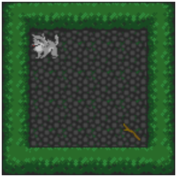
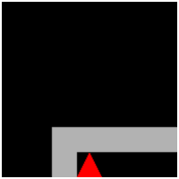
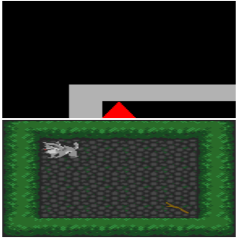
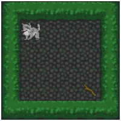

# [MiniGridDoggo](@id minigrid_doggo)
The best to get a hand on Griddly and its functionnality is through an example. We are going to have a raw
example with the minigrid\_doggo game and then the same example with a Render Window. This one is really easy to
use since there is only one action type:"move".

## Start
First step, either for raw or with a render, is to: load all the necessary resources files into the working directory and instantiate the grid:

```julia
using Griddly

image_path = joinpath(@__DIR__,"path_to_resources_folder","resources","images");

shader_path = joinpath(@__DIR__,"path_to_resources_folder","resources","shaders");

gdy_path = joinpath(@__DIR__,"path_to_resources_folder","resources","games");

gdy_reader = Griddly.GDYReader(image_path,shader_path);

grid = Griddly.load!(gdy_reader,joinpath(gdy_path,"Single-Player/Mini-Grid/minigrid-doggo.yaml"))
```

## Raw
Once everything is initiated we can create a game and register the player (it's a one player game)

```julia
game = Griddly.create_game(grid,Griddly.SPRITE_2D)

player1 = Griddly.register_player!(game,"Bob", Griddly.BLOCK_2D)

Griddly.init!(game)
```

From here, everything is ready to play MiniGridDoggo. We are going to play randomly
for 200 steps for each of the provided levels.

```julia
for l in 0:4
    Griddly.load_level!(grid,l)
    Griddly.reset!(game)
    total_reward = 0
    for j in 1:200
        dir = rand(1:4)

        reward, done = Griddly.step_player!(player1,"move", [dir])

        total_reward += reward
    end
    println("Total reward for level $l:$total_reward")
end
```
## Raw with vector Observation
We have two ways to get the vector observations. One way is to define the game
observer to VECTOR and use the `observe` function. The other one is to call the
`vector_obs` on the grid. We will see both.

### Game Observer: Vector

```julia
# game observer is defined here
game = Griddly.create_game(grid,Griddly.VECTOR)

player1 = Griddly.register_player!(game,"Bob", Griddly.VECTOR)

Griddly.init!(game)
```

Let's play onto the first level which looks like this on intial state:
```yaml
W  W  W  W  W  W
W  A  .  .  .  W
W  .  .  .  .  W
W  .  .  .  .  W
W  .  .  .  g  W
W  W  W  W  W  W
```

To do so we only need to do the following command:

```julia
Griddly.load_level!(grid,0)

Griddly.reset!(game)
```

Now if you want to observe the initial state you can do as follows:

```julia
# get the Numpy object
vector_observation = Griddly.observe(game)
# get the actual array from the Numpy object
vector_observation = Griddly.get_data(vector_observation)
# the data are Array{Uint,3}, if you want a clear representation you can convert to Int
vector_observation = convert(Array{Int,3},vector_observation)
```

Or in one step:

```julia
vector_observation = convert(Array{Int,3},Griddly.get_data(Griddly.observe(game)))
```

Now, if you look at the VECTOR Observer definition, here is what you will get when printing
`vector_observation`:

| Goal       | Wall      | Avatar    |
|     :---:  |     :---: |     :---: |
|0 0 0 0 0 0 |1 1 1 1 1 1|0 0 0 0 0 0|
|0 0 0 0 0 0 |1 0 0 0 0 1|0 1 0 0 0 0|
|0 0 0 0 0 0 |1 0 0 0 0 1|0 0 0 0 0 0|
|0 0 0 0 0 0 |1 0 0 0 0 1|0 0 0 0 0 0|
|0 0 0 0 1 0 |1 0 0 0 0 1|0 0 0 0 0 0|
|0 0 0 0 0 0 |1 1 1 1 1 1|0 0 0 0 0 0|

So now if we want to see the vector observation for 200 steps that's how we can do it
```julia
total_reward = 0
for j in 1:200
    dir = rand(1:4)

    reward, done = Griddly.step_player!(player1,"move", [dir])
    vector_observation = convert(Array{Int,3},Griddly.get_data(Griddly.observe(game)))
    total_reward += reward
    println(vector_observation)
end
println("Total reward for level $l:$total_reward")
end
```

### vector_obs(grid)
Imagine that you want to render your game but still need the vector observation,
for instance because it's the input of a Neural Network. You will define your game
observer as SPRITE_2D and get  the VECTOR observation directly from the underlying grid.
```julia
game = Griddly.create_game(grid,Griddly.SPRITE_2D)

player1 = Griddly.register_player!(game,"Bob", Griddly.BLOCK_2D)

Griddly.init!(game)

Griddly.load_level!(grid,0)

Griddly.reset!(game)
# the change happens here
vector_observation = convert(Array{Int,3},Griddly.get_data(Griddly.vector_obs(grid)))

total_reward = 0
for j in 1:200
    dir = rand(1:4)

    reward, done = Griddly.step_player!(player1,"move", [dir])
    vector_observation = convert(Array{Int,3},Griddly.get_data(Griddly.vector_obs(grid)))
    total_reward += reward
    println(vector_observation)
end
println("Total reward for level $l:$total_reward")
end
```
## Render
### RenderWindow: SPRITE_2D
We want to render what a player would see at his screen.

```julia
game = Griddly.create_game(grid,Griddly.SPRITE_2D)

player1 = Griddly.register_player!(game,"Bob", Griddly.BLOCK_2D)

Griddly.init!(game)

for l in 0:4
    # create a render window for each level (performance purpose)
    render_window = RenderWindow(700,700)

    Griddly.load_level!(grid,l)
    Griddly.reset!(game)
    sprites = Griddly.get_data(Griddly.observe(game))
    render(render_window,sprites)
    total_reward = 0
    for j in 1:200
        dir = rand(1:4)

        reward, done = Griddly.step_player!(player1,"move", [dir])
        total_reward += reward

        sprites = Griddly.get_data(Griddly.observe(game))
        render(render_window,sprites)

    end
    println("Total reward for level $l:$total_reward")
end
```
You should have a render that looks like it:



### RenderWindow: BLOCK_2D
We want to render the agent view (partial game observation) with simple geometric forms.

```julia
game = Griddly.create_game(grid,Griddly.SPRITE_2D)

player1 = Griddly.register_player!(game,"Bob", Griddly.BLOCK_2D)

Griddly.init!(game)

for l in 0:4
    # create a render window for each level (performance purpose)
    render_window = RenderWindow(700,700)

    Griddly.load_level!(grid,l)
    Griddly.reset!(game)
    player_tiles = Griddly.get_data(Griddly.observe(player1))
    render(render_window,player_tiles)
    total_reward = 0
    for j in 1:200
        dir = rand(1:4)

        reward, done = Griddly.step_player!(player1,"move", [dir])
        total_reward += reward

        player_tiles = Griddly.get_data(Griddly.observe(player1))
        render(render_window,player_tiles)
    end
    println("Total reward for level $l:$total_reward")
end
```
You should have a render that looks like it:


### Render the Game and the Player observations
We want to see side by side the game with sprites and the player observations with blocks.

```julia
game = Griddly.create_game(grid,Griddly.SPRITE_2D)

player1 = Griddly.register_player!(game,"Bob", Griddly.BLOCK_2D)

Griddly.init!(game)

for l in 0:4
    # create a multiple window for each level (performance purpose)
    multiple_window = MultipleScreen(700,700)

    Griddly.load_level!(grid,l)
    Griddly.reset!(game)

    observations = Griddly.get_data(Griddly.observe(game))
    player_tiles = Griddly.get_data(Griddly.observe(player1))
    render_multiple(multiple_window,[observations,player_tiles])

    total_reward = 0
    for j in 1:200
        dir = rand(1:4)

        reward, done = Griddly.step_player!(player1,"move", [dir])
        total_reward += reward

        observations = Griddly.get_data(Griddly.observe(game))
        player_tiles = Griddly.get_data(Griddly.observe(player1))
        render_multiple(multiple_window,[observations,player_tiles])

    end
    println("Total reward for level $l:$total_reward")
end
```
You should have a render that looks like it:



## VideoRecorder
If you want to save one of your agent's episode as a gif (or .mp4) here is how you
should do it:

```julia
game = Griddly.create_game(grid,Griddly.SPRITE_2D)

player1 = Griddly.register_player!(game,"Bob", Griddly.BLOCK_2D)

Griddly.init!(game)

Griddly.load_level!(grid,0)

Griddly.reset!(game)
# create a a VideoRecorder object
video = VideoRecorder((700,700),"minigriddoggo";format=".gif",saving_path="your_videos_folder/")
# start the stream
io = start_video(video)

sprites = Griddly.get_data(Griddly.observe(game))
add_frame!(video,io,sprites)
total_reward = 0
for j in 1:200
    dir = rand(1:4)

    reward, done = Griddly.step_player!(player1,"move", [dir])
    total_reward += reward

    sprites = Griddly.get_data(Griddly.observe(game))
    add_frame!(video,io,sprites)
end
println("Total reward for level $l:$total_reward")
save_video(video,io)
```
Here is the GIF I get when running this piece of code:


