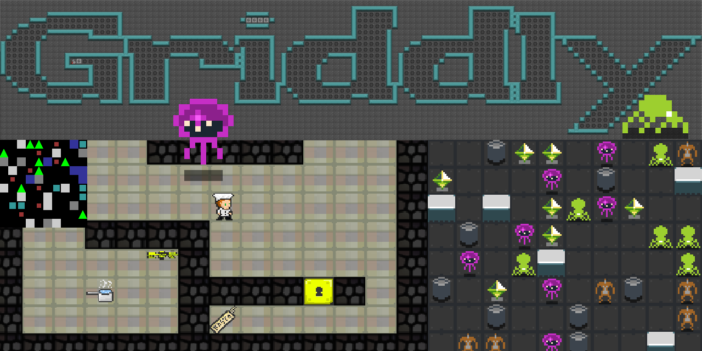

# Griddly.jl
*A documentation for the Julia wrapper of* [**Griddly**](https://github.com/Bam4d/Griddly)

!!! note
    This documentation doesn't aim to explain what is Griddly, for that please
    read through the original **Griddly** [documentation](https://griddly.readthedocs.io/en/latest/?badge=latest)



## Installation

```@contents
Pages = ["installation.md"]
```

## Library Outline

```@contents
Pages = [
    "lib/observer.md",
    "lib/grid.md",
    "lib/game_process.md",
    "lib/player.md",
    "lib/render_tool.md",
    "lib/utils.md"
]
```

## Examples

```@contents
Pages = [
    "examples/minidroggo.md"
    "examples/sokoban.md"
    "examples/multiplayer.md"
]
```
