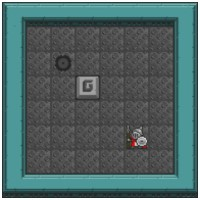
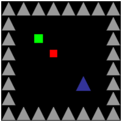

# [Observer](@id observer_type)

You can define at present 5 ObserverType: NONE, SPRITE\_2D, BLOCK\_2D, VECTOR and ISOMETRIC.

The choice of the ObserverType will influence the observe function output.

## SPRITE_2D

This ObserverType will observe the RGB matrix of the sprites of the game, for instance if
we choose to play Sokoban we will get the following rendering:

## BLOCK_2D

This ObserverType aims to still have an image rendering while simplifying the datas by representing
tiles with geometrics forms. For instance the BLOCK_2D representation of the previous images is as follows:

## VECTOR

This ObserverType is the simplest. Indeed, when observing the game you will get a 3D Array of size (width,height,nb\_object\_in\_yaml\_file). So if we observe the same game as previously we will get the following output:

| Box           | Wall          | Hole          | Agent         |
|     :---:     |     :---:     |     :---:     |     :---:     |
|0 0 0 0 0 0 0 0|1 1 1 1 1 1 1 1|0 0 0 0 0 0 0 0|0 0 0 0 0 0 0 0|
|0 0 0 0 0 0 0 0|1 0 0 0 0 0 0 1|0 0 0 0 0 0 0 0|0 0 0 0 0 0 0 0|
|0 0 0 0 0 0 0 0|1 0 0 0 0 0 0 1|0 0 1 0 0 0 0 0|0 0 0 0 0 0 0 0|
|0 0 0 1 0 0 0 0|1 0 0 0 0 0 0 1|0 0 0 0 0 0 0 0|0 0 0 0 0 0 0 0|
|0 0 0 0 0 0 0 0|1 0 0 0 0 0 0 1|0 0 0 0 0 0 0 0|0 0 0 0 0 0 0 0|
|0 0 0 0 0 0 0 0|1 0 0 0 0 0 0 1|0 0 0 0 0 0 0 0|0 0 0 0 0 1 0 0|
|0 0 0 0 0 0 0 0|1 0 0 0 0 0 0 1|0 0 0 0 0 0 0 0|0 0 0 0 0 0 0 0|
|0 0 0 0 0 0 0 0|1 1 1 1 1 1 1 1|0 0 0 0 0 0 0 0|0 0 0 0 0 0 0 0|

## ISOMETRIC
### TODO
